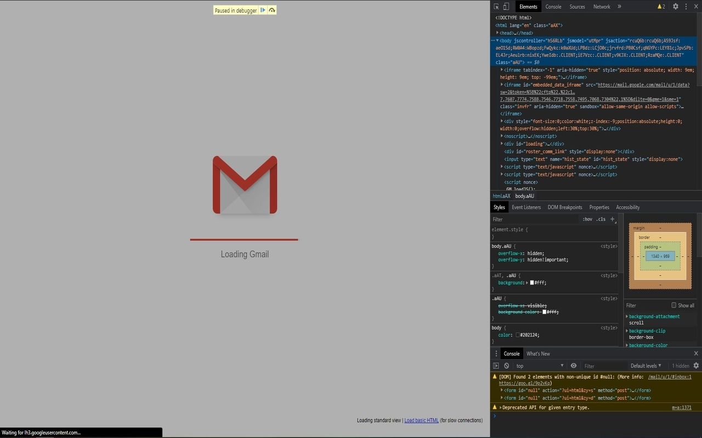
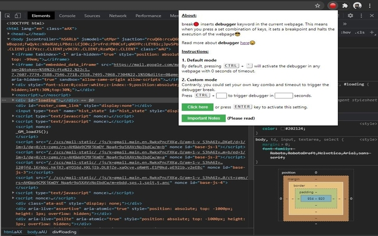

# break🔴

Simple Chrome extension to put "debugger" on any webpage so that it pauses

# Description

Have you wanted to pause execution of some web-page so that you can inspect the state of the page or various elements on it at some given moment. This of course can be trivial if you're trying to do this to your own website on localhost since you could just set a break-point or add the ["debugger" keyword](https://www.w3schools.com/jsref/jsref_debugger.asp) on the code. This however is not the case for other websites you may not own or have access to source code to. One workaround could be to manually enter the "debugger" keyword in the dev console but this can get complicated with dynamic pages and if you want to inspect the page mid transitions. break🔴 is built for this very use-case in mind.

break🔴 inserts "debugger" keyword in the current web-page. This means when you press a set combination of keys, it sets a break-point and halts the execution of the web-page😎

Instructions:

1. Default mode
   By default, pressing Ctrl + ` will activate the debugger in any web-page with 0 seconds of timeout delay

2. Custom mode
   Contrarily, you could set your own key combo and timeout to trigger the debugger break.
   Press Ctrl + <your_choice_of_letter> to trigger debugger in <your_choice_of_time> seconds.

Important Notes (Please read):

1. The Dev Console must be open on the webpage for this to work
2. The key press events are expected to come from the webpage's body so make sure to switch to the context of the webpage by clicking on any part of its body before triggering the debugger
3. The default mode is active by default and needs no explicit activation
4. The default mode can't be overwritten
5. Custom settings get eliminated as soon as you refresh the webpage and don't persist across pages
6. Any previous settings can't be overwritten unless the webpage is refreshed (except the default)
7. <Space_bar> key can't be used for the key combos
8. Negative values in the number input field will be interpreted as 0

# Screenshots

1. Gmail paused
     
2. Popup  
   
